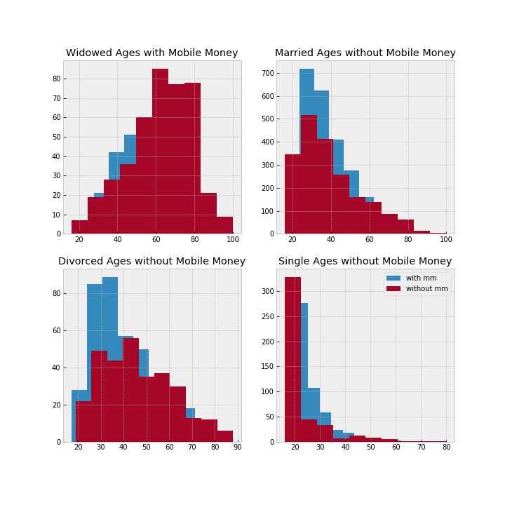

# Mobile Money in Tanzania

## Contents

- What is Mobile Money
- Aim of Research
- Insights
  - Maritial Status
  - Ages
  - Gender
  - Sources of Income
  - Region
- Conclusion

## What is Mobile Money?

It is an electronic wallet service that allows users to store, send and recieve money user their mobile devices. It is used in many countries, such as China uses WeChat. It is an alternative to using bank accounts. It can be operated using both smartphones and basic feature phones.

## Aim of Research

The aim is find and visulise the suitable target audience Mobile Money can be aim at to increase sales.

## Insights

### Maritial Status

There were four main catagories that were checked - married, single, divorced and widows. It was found that single people had the highest percentage of people with Mobile Money with 62.6%, with Married people coming second with 56.1%. The most unusual discovery was that Widowed people actually had the lowest number of people with Mobile Money, at 38.1%. There were a lot of reasons of why this number was so low and one of them was age.

<!-- Add Graph Here -->

### Ages

When there was a comparison of the ages of different people with different maritial statuses, the results gave one opinion on why Widowed people chose not to have Mobile Money. All other Maritial statuses contained people who were really young. The Widowed graph shows that there are more widowed people who are older. This could pose a question: Widowed people do not have Mobile Money because they are older and are not as Tech Savvy? Or could it be that they much rather continue with conventional methods?

### Gender

It was found that there are more males with mobile money than there are females with mobile money. 31.4 % of Males from the total population have Mobile Money, whilst 24.8% of Females have Mobile Money. The average ages of males and females with Mobile Money is 37 and 35 respectively. Yet there were more female widows as compared to their male counterparts. A staggering 86.4% of widows are female and of which only 33.2% have Mobile Money. This poses the question: Is Mobile Money mostly advertised towards males?

<!-- Add Graph Here -->

### Sources of Income

Most of the widows recieve their source of income from trading or selling products. The only time you find a higher ratio of people with Mobile Money are people who earn income through wages, investments, pensions and services. The rest of the streams of income have more people without Mobile Money. Does this mean that the people with low quality jobs are not interested in Mobile Money? Could the Mobile Money companies neglecting the working class even though there is more of them?

<!-- Add Graph Here -->

### Region

Most people are located near water sources such as oceans or rivers. This is in correlation with that a lot of people have earn income through trading. Since they are located in areas that make it easier for them to transport their goods (via shippment). People with Mobile Money are mostly found in regions Tanzania that have the highest GDP's. These regions are Muanza Region (GDP of $13,789 mil) and Shinyanga Region (GDP of $8,431 mil). It shows that Mobile Money companies tend to aim at people with hight quality jobs.

<!-- Add Graph Here -->

## Conclusion

It seems that Mobile Money companies are mostly advertising to young males with high quality of jobs. They are ignoring a big target audience that will be able to increase their sales even way more. Mobile Money companies need to target old females who are trading. They make up most of the population and yet their are the ones who are not being marketed to. Mobile Money companies are losing a lot of sales and money because of this mistake.
